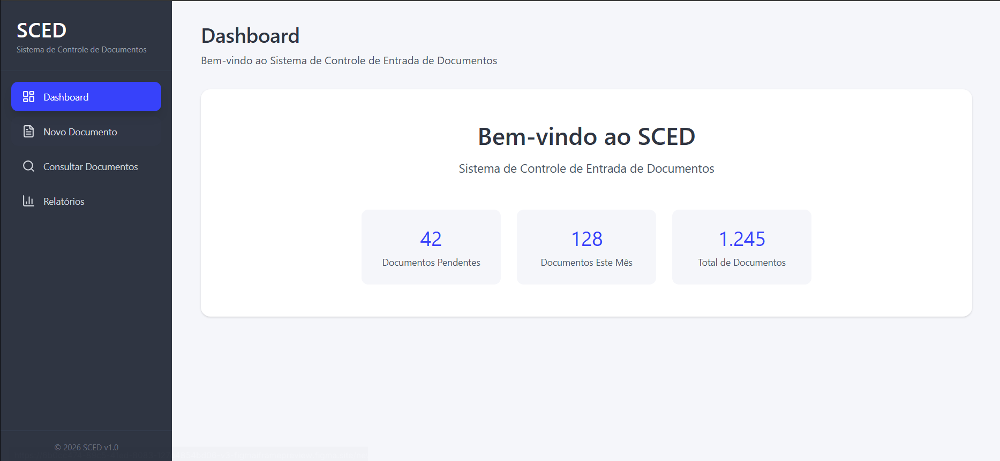
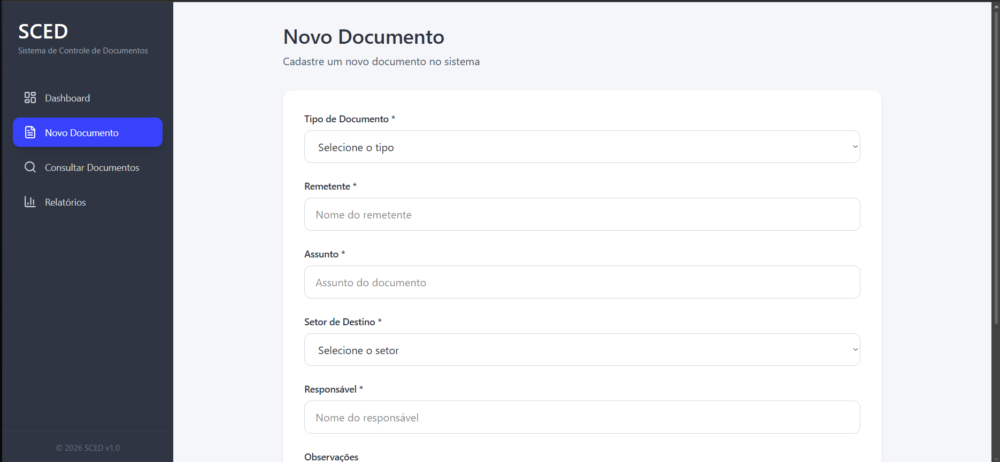
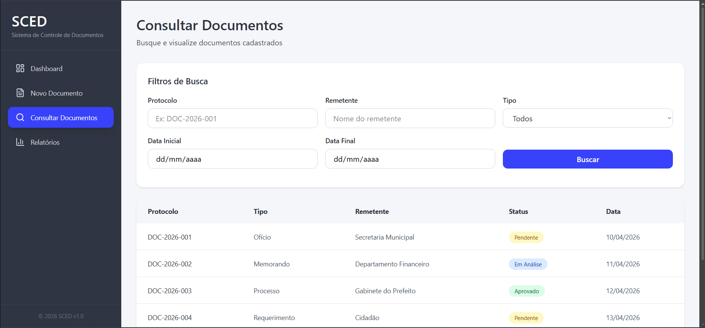
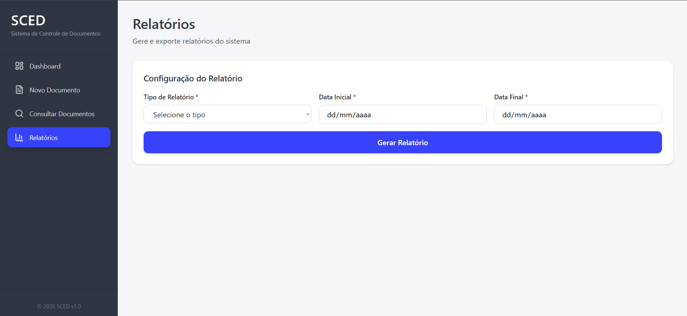

# Protótipo Visual - Sistema SCED

## Descrição

Este documento apresenta o protótipo visual de alta fidelidade do sistema SCED (Sistema de Controle de Entrada de Documentos), desenvolvido a partir dos wireframes previamente definidos.

O objetivo foi aplicar melhorias visuais, padronização de layout e aprimoramento da experiência do usuário (UX).

---

## Padrão Visual

- Cor principal: Azul (#3742FA)
- Cor de fundo: Cinza claro (#F5F6FA)
- Menu lateral: Cinza escuro (#2F3542)
- Botões com bordas arredondadas
- Tipografia simples e legível
- Layout moderno com menu lateral fixo

---

## Telas Desenvolvidas

### Dashboard

Tela inicial do sistema com visão geral e mensagem de boas-vindas ao usuário.

---

### Cadastro de Documento

Tela responsável pelo registro de novos documentos no sistema.

Campos principais:
- Tipo de documento
- Remetente
- Assunto
- Setor de destino
- Responsável
- Observações

---

### Consulta de Documentos

Permite buscar documentos cadastrados através de filtros.

Filtros disponíveis:
- Protocolo
- Remetente
- Tipo
- Período

---

### Relatórios

Geração de relatórios com base em filtros definidos.

Funcionalidades:
- Seleção de tipo de relatório
- Filtro por data
- Visualização em tabela
- Exportação (PDF)

---

## Considerações Finais

O protótipo foi desenvolvido com foco em:

- Usabilidade
- Organização visual
- Consistência entre telas
- Facilidade de navegação

As telas representam uma versão próxima do sistema final, podendo ser utilizadas como base para implementação futura.
