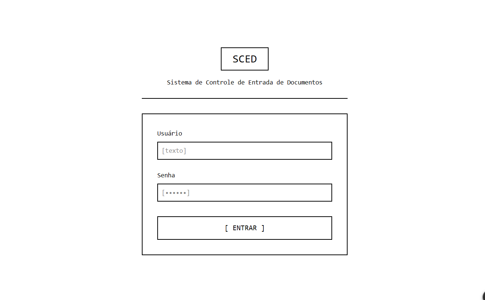
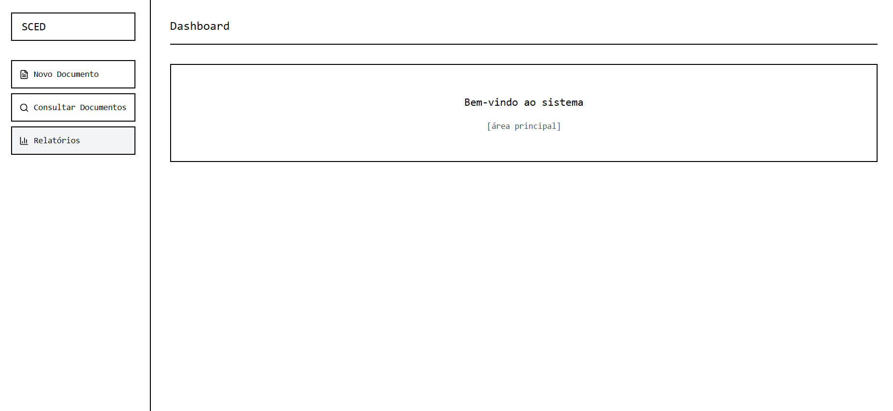
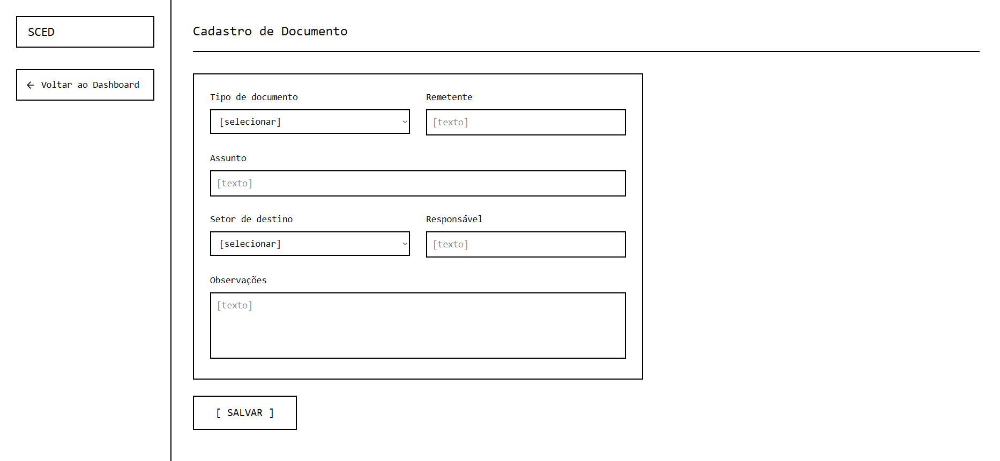
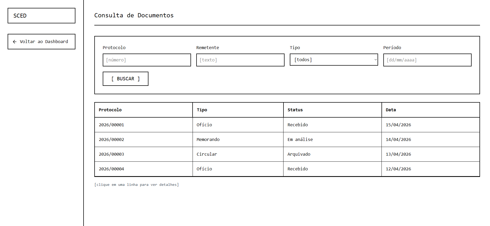
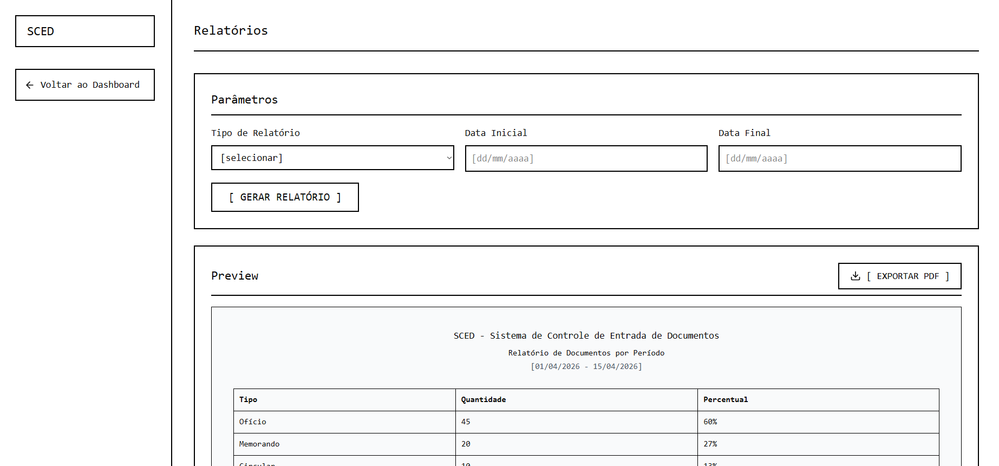

# Wireframes do Sistema SCED

## Tela de Login

## Dashboard

## Cadastro de Documento

## Consulta de Documentos

## Detalhes do Documento

## Observação

Os wireframes foram desenvolvidos utilizando o Figma, representando a estrutura inicial do sistema.